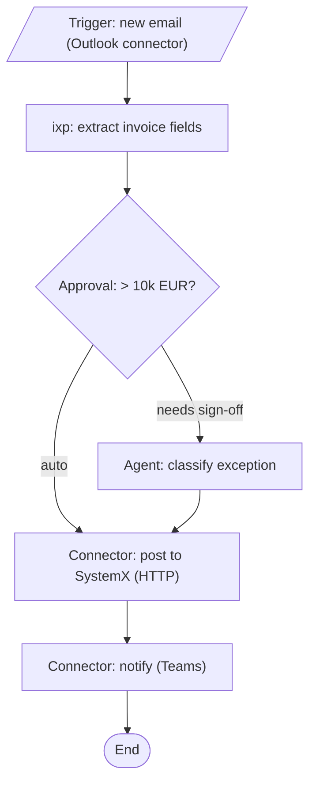

# Maestro framework (wi:rpa 1.0.0) Implementation Plan

> **For agentic workers:** REQUIRED SUB-SKILL: Use superpowers:subagent-driven-development (recommended) or superpowers:executing-plans to implement this plan task-by-task. Steps use checkbox (`- [ ]`) syntax for tracking.

**Goal:** `wi:rpa` can target UiPath Maestro flows as a first-class framework alongside REFramework — a `Framework: reframework | maestro` choice (above the build paradigm) decided at brainstorm and confirmed at the gate, making the architecture, SDD, build, and verification framework-aware.

**Architecture:** A prose + delegation change. Two new reference docs (`maestro-architecture.md`, `build-maestro.md`) describe the Maestro flow shape; `rpa/SKILL.md` and the existing references are threaded so the REFramework path is unchanged and the Maestro path routes to `uipath-maestro-flow` for build/validate/eval. No code.

**Tech Stack:** Markdown skills with OKF frontmatter; `python scripts/validate.py` (manifests, frontmatter, `${CLAUDE_PLUGIN_ROOT}` resolution — which catches a mistyped new-file path — fence/newline balance); `git`. No new scripts/tests.

**Spec:** `docs/specs/2026-06-16-maestro-framework-design.md` (read first — the Framework model, the framework-aware planning/build/verify, and acceptance criteria 1–10).

---

## File Structure

- **Create** `skills/rpa/references/maestro-architecture.md` — the Maestro flow architecture (node types, flow-diagram example, build DAG).
- **Create** `skills/rpa/references/build-maestro.md` — the Maestro build (delegate to `uipath-maestro-flow`).
- **Modify** `skills/rpa/SKILL.md` — thread `Framework` through brainstorm/plan/gate/build/verify.
- **Modify** `skills/rpa/references/brainstorm-protocol.md` — framework-selection must-ask + shape note.
- **Modify** `skills/rpa/references/sdd-template.md` — framework-conditional ToC.
- **Modify** `skills/rpa/references/verification-gate.md` — Maestro branch.
- **Modify** `skills/rpa/references/build-uipath.md` + `refr-architecture.md` — one-line "REFramework path" scope notes.
- **Modify** `skills/rpa/references/rpa-constitution-template.md` — `Framework:` default + Maestro sub-section.
- **Modify** `skills/rpa/references/rpa-directory.md` — `Framework:` progress field + register the two new files.
- **Modify** the three manifests + `README.md` — `0.11.0 → 1.0.0` + Roadmap bullet.

Each task ends green on `python scripts/validate.py` and is one commit. Tasks 1–2 (new docs) come first so the `${CLAUDE_PLUGIN_ROOT}` references added in later tasks resolve.

---

## Task 1: Create `maestro-architecture.md`

**Files:**
- Create: `skills/rpa/references/maestro-architecture.md`

- [ ] **Step 1: Write the file** with exactly this content:

```markdown
---
type: Reference
title: "Maestro flow architecture & the solution flow diagram"
description: "The Maestro framework: a UiPath Maestro flow (.flow) is an orchestration of nodes — connector, approval, script, subflow, agent, ixp — not a REFramework state machine. Use when Framework = maestro."
timestamp: 2026-06-16
tags: [rpa, maestro, reference]
---

# Maestro flow architecture & the solution flow diagram

Used when **`Framework: maestro`** (the REFramework path is `refr-architecture.md`). A UiPath **Maestro flow**
(`.flow`) is an **orchestration flow of nodes**, not a queue-based state machine: there is no Dispatcher/
Performer, no `Config.xlsx`, no queue transaction loop. A flow wires a **trigger** through **nodes** —
**connector** (Integration Service), **approval** (human-in-the-loop), **script**, **subflow**, **agent**
(a UiPath Agent call), **ixp** (document understanding) — to an end. Build/validate/eval are delegated to
the `uipath-maestro-flow` skill (`uip maestro flow`).

There are **two** architecture artifacts, mapping to the SDD:

- **`architecture.md` (run/solution level) = the flow diagram (SDD §2):** the whole solution — every flow,
  its trigger, the systems/connectors/agents it touches, and any subflows.
- **per-process flow diagram (SDD §7.1.3):** one process's flow, the zoom-in (lives in that process's
  `tobe.md` / SDD §7.1.3).

Both are mermaid and **must be validated** with
`${CLAUDE_PLUGIN_ROOT}/skills/scan/scripts/check_mermaid.py` (safe node IDs — never `graph`/`end`/etc.;
quote labels containing `:` `/` `(`).

## Flow diagram — whole solution

Show the trigger, each node in order, the systems/connectors/agents touched, approvals, and any subflows.
Example:



Scale it to the real solution: one node per connector/approval/script/subflow/agent/ixp step; show every
external system and each human-approval branch. Keep node IDs short and safe; quote labels with special
characters.

## What a Maestro flow is (the skeleton)

```
project.json            # Maestro flow project descriptor
<flow>.flow             # the flow: nodes + connections (trigger -> nodes -> end)
<subflow>.flow          # optional subflows invoked by the main flow
```

No `Framework/`, no `Main.xaml` state machine, no `Data/Config.xlsx`. Configuration/secrets are connections
and Orchestrator assets referenced by the connector/agent nodes — never hardcoded.

## The Maestro build DAG (drives parallelism)

`tasks.md` orders the build:

1. **Shared components** (Wave 1) — anything in `.wi/components.md` the flows depend on, first.
2. **Per-flow scaffolds** — each `.flow` (independent flows in parallel).
3. **Subflows** — independent subflows within a flow in parallel; the main `.flow` serializes its wiring.
4. **Wire-up** — connections / triggers / agent registrations via `uipath-platform`.

## When Maestro fits

Maestro suits orchestration-shaped work — human approvals/HITL, Integration Service connectors, UiPath
Agent calls, long-running/wait-heavy steps, document understanding (ixp), branching across systems.
High-volume queue-based batch transaction processing stays **REFramework** (`refr-architecture.md`). The
brainstorm proposes the framework from this shape and the gate confirms it.
```

- [ ] **Step 2: Validate**

Run: `python scripts/validate.py`
Expected: `[OK] all checks passed` (exit 0) — confirms frontmatter, fence balance, and `${CLAUDE_PLUGIN_ROOT}` references resolve. (The mermaid example is illustrative; no separate mermaid run needed.)

- [ ] **Step 3: Commit**

```bash
git add skills/rpa/references/maestro-architecture.md
git commit -m "docs(rpa): add maestro-architecture reference (Maestro flow shape)"
```

---

## Task 2: Create `build-maestro.md`

**Files:**
- Create: `skills/rpa/references/build-maestro.md`

- [ ] **Step 1: Write the file** with exactly this content:

```markdown
---
type: Reference
title: "Build — Maestro flow (.flow) via uipath-maestro-flow"
description: "How wi:rpa builds when Framework = maestro: delegate flow generation to the uipath-maestro-flow skill, validate with uip maestro flow."
timestamp: 2026-06-16
tags: [rpa, maestro, reference]
---

# Build — Maestro flow (`.flow`)

Used when **`Framework: maestro`** (the REFramework path is `build-uipath.md`). wi owns the method, the gate,
and the artifacts; **`uipath-maestro-flow` owns the build** — borrow, don't reinvent.

## 1. Execute the build DAG in waves (from `tasks.md`)

The DAG is: **shared components → per-flow scaffolds → subflows → wire-up** (see `maestro-architecture.md`).
Run it as wide as the DAG allows.

1. **Reuse first.** Before generating anything, check `.wi/components.md`; reuse a shared flow/subflow or a
   Library before building new.
2. **Generate the flow.** Delegate each flow/subflow to **`uipath-maestro-flow`** in parallel waves. **State
   the node plan from the SDD in every delegation prompt** — the trigger, each node (connector / approval /
   script / subflow / agent / ixp) with its inputs/outputs, the connections/agents it uses, and the
   approval/branch logic. Scaffold each unit as a Maestro flow per the SDD, never blank.
3. **Per-unit verify.** After each unit, the work isn't done until it at least validates —
   `uip maestro flow validate` (see the verification gate); a generated `.flow` must reflect the SDD's nodes.
4. **Commit small + record tokens.** One flow/subflow per focused commit (`feat(<flow>): ...`); tick
   `progress.md`. **Append each delegated unit's token count to `tokens.md`** the moment that subagent
   reports completion (the only point the count exists) — `tokens.md` is **mandatory**; initialize it on the
   first delegation if absent
   (`python3 ${CLAUDE_PLUGIN_ROOT}/skills/ship/scripts/check_tokens.py --init .wi/goals/<slug>/tokens.md`),
   and ship finalizes it (`token_report.py --write`) under a `check_tokens.py` close-out gate.
5. **Register new components.** If the build created something reusable (a shared subflow, a notifier flow),
   add it to `.wi/components.md` so the next flow inherits it.

## 2. Wire-up (if in scope)

For connections / triggers / agent registrations, delegate to `uipath-platform` (it owns the `uip` CLI +
Orchestrator side). Connection and asset **names** come from `.wi/orchestrator.md`; values live in
Orchestrator, never in the flow.
```

- [ ] **Step 2: Validate**

Run: `python scripts/validate.py`
Expected: `[OK] all checks passed` (exit 0).

- [ ] **Step 3: Commit**

```bash
git add skills/rpa/references/build-maestro.md
git commit -m "docs(rpa): add build-maestro reference (delegate to uipath-maestro-flow)"
```

---

## Task 3: `sdd-template.md` — framework-conditional ToC

**Files:**
- Modify: `skills/rpa/references/sdd-template.md`

- [ ] **Step 1: Add the framework-conditional note** after the "Choosing the structure (ToC) — precedence" intro.

Replace exactly:
```
Whichever you use, fill every section from the design; if a section can't be filled, that's a brainstorm
gap to resolve, not a TODO to leave.
```
With:
```
Whichever you use, fill every section from the design; if a section can't be filled, that's a brainstorm
gap to resolve, not a TODO to leave.

**The ToC is framework-aware** (`progress.md` → `Framework:`). The base ToC below is the **REFramework**
shape. On the **Maestro** path, reshape these sections: **§2** becomes the **flow diagram** (from
`maestro-architecture.md`); **§3.1** the Maestro project/flow layout (the `.flow` files, not REFramework);
**§7.1.x** the flow's **nodes** (each node's type — connector / approval / script / subflow / agent / ixp —
its inputs/outputs, and the connection/agent it uses), **not** a transaction + queue-item schema; **§7.2–7.6**
become Maestro **connections, triggers, and agent registrations** — Orchestrator **queues** and `Config.xlsx`
do not apply. §7.1.3 stays the per-process flow diagram for both.
```

- [ ] **Step 2: Validate + commit**

Run: `python scripts/validate.py` → `[OK] all checks passed`.
```bash
git add skills/rpa/references/sdd-template.md
git commit -m "docs(rpa): framework-aware SDD ToC (Maestro sections)"
```

---

## Task 4: `rpa/SKILL.md` — thread `Framework` through the pipeline

**Files:**
- Modify: `skills/rpa/SKILL.md` (steps 3, 4, 5, 6, 7)

- [ ] **Step 1: Step 3 (brainstorm) — propose the framework**

Replace exactly:
```
   processes**, and for each define the transaction and dispatcher/performer shape, and **elicit the Orchestrator
```
With:
```
   processes**, **propose the framework** (`reframework` | `maestro`) from the process shape (heuristic in
   `brainstorm-protocol.md` / the constitution) and record it in `progress.md` (`Framework:`), and for each
   define the transaction + dispatcher/performer shape (REFramework) **or** the flow's node shape (Maestro),
   and **elicit the Orchestrator
```

- [ ] **Step 2: Step 4 (plan) — framework-aware architecture + SDD**

Replace exactly:
```
   - **`architecture.md`** — the whole-solution **Runtime diagram** (Dispatcher + every Performer, incl. a
     2nd/3rd, + queues + systems + Orchestrator; see `references/refr-architecture.md`), validated with
     `${CLAUDE_PLUGIN_ROOT}/skills/scan/scripts/check_mermaid.py`.
```
With:
```
   - **`architecture.md`** — framework-aware, validated with
     `${CLAUDE_PLUGIN_ROOT}/skills/scan/scripts/check_mermaid.py`: **REFramework** → the Runtime diagram
     (Dispatcher + every Performer + queues + systems + Orchestrator; see `references/refr-architecture.md`);
     **Maestro** → the flow diagram (trigger + nodes + systems/agents; see `references/maestro-architecture.md`).
```

- [ ] **Step 3: Step 4 (plan) — SDD ToC is framework-aware**

Replace exactly:
```
   - **`sdd.md`** — one Solution Design Document. **Choose the ToC** per the precedence in
     `references/sdd-template.md`: an existing project SDD's ToC wins → `.wi/sdd-template.md` → the bundled
     base ToC. §7.1.x repeats per process; §7.1.3 is each process's flow diagram (kept in its `tobe.md`);
     §1.3/§3.1/§7.2–7.6 are filled from `.wi/orchestrator.md` (the elicited resource names).
```
With:
```
   - **`sdd.md`** — one Solution Design Document. **Choose the ToC** per the precedence in
     `references/sdd-template.md` (an existing project SDD's ToC wins → `.wi/sdd-template.md` → the bundled
     base ToC) — and **shape it to the `Framework`** (REFramework vs Maestro sections, per that template).
     §7.1.x repeats per process; §7.1.3 is each process's flow diagram (kept in its `tobe.md`);
     §1.3/§3.1/§7.2–7.6 are filled from `.wi/orchestrator.md` (the elicited resource names).
```

- [ ] **Step 4: Step 5 (gate) — confirm framework, paradigm only if REFramework**

Replace exactly:
```
   ground**), recorded in `progress.md` (`Build paradigm:`). **Also approve the publish decision** —
```
With:
```
   ground**) — **first confirm the framework** (`reframework` | `maestro`, proposed in brainstorm, recorded
   in `progress.md` as `Framework:`); the **build paradigm applies only when `Framework: reframework`**,
   recorded in `progress.md` (`Build paradigm:`). **Also approve the publish decision** —
```

- [ ] **Step 5: Step 6 (build) — route to the framework's build reference/skill**

Replace exactly:
```
6. **Build.** Follow `${CLAUDE_PLUGIN_ROOT}/skills/rpa/references/build-uipath.md`: create the worktree,
   **reuse components from `.wi/components.md` before building new**, delegate **low-code XAML REFramework**
   generation to `uipath-rpa-workflows` per process/sub-workflow in **parallel waves** (state the paradigm in
```
With:
```
6. **Build.** Create the worktree, **reuse components from `.wi/components.md` before building new**, then
   build per the **`Framework`**: **REFramework** → `${CLAUDE_PLUGIN_ROOT}/skills/rpa/references/build-uipath.md`,
   delegating to `uipath-rpa-workflows`; **Maestro** → `${CLAUDE_PLUGIN_ROOT}/skills/rpa/references/build-maestro.md`,
   delegating to `uipath-maestro-flow`. (REFramework:) delegate **low-code XAML REFramework**
   generation to `uipath-rpa-workflows` per process/sub-workflow in **parallel waves** (state the paradigm in
```

- [ ] **Step 6: Step 7 (verify) — framework-aware gate**

Replace exactly:
```
7. **Verify & ship.** Gate = `${CLAUDE_PLUGIN_ROOT}/skills/rpa/references/verification-gate.md` (**paradigm =
   XAML REFramework** + Workflow Analyzer + `uip` validate + `tokens.md` passes `check_tokens.py` + the **goal-level checker · result mode** over `sdd.md` §13). Then reuse the **ship**
```
With:
```
7. **Verify & ship.** Gate = `${CLAUDE_PLUGIN_ROOT}/skills/rpa/references/verification-gate.md`, **branched on
   `Framework`**: REFramework → approved paradigm + Workflow Analyzer + `uip` validate; Maestro →
   `uip maestro flow validate` (+ `eval` if eval sets exist). Both → `tokens.md` passes `check_tokens.py`
   + the **goal-level checker · result mode** over `sdd.md` §13. Then reuse the **ship**
```

- [ ] **Step 7: Validate + commit**

Run: `python scripts/validate.py` → `[OK] all checks passed`.
```bash
git add skills/rpa/SKILL.md
git commit -m "feat(rpa): thread Framework (reframework|maestro) through brainstorm/plan/gate/build/verify"
```

---

## Task 5: `brainstorm-protocol.md` — framework-selection must-ask

**Files:**
- Modify: `skills/rpa/references/brainstorm-protocol.md`

- [ ] **Step 1: Add a framework must-ask** to the "Must-ask before the design gate" list.

Replace exactly:
```
1. **Scope** — confirm in/out (§1).
```
With:
```
1. **Scope** — confirm in/out (§1).
1. **Framework** — **REFramework or Maestro flow?** Propose from the process shape: **Maestro** for
   orchestration-shaped work (approvals/HITL, Integration Service connectors, UiPath Agent calls,
   long-running/wait-heavy, ixp, branching across systems); **REFramework** for high-volume queue-based
   batch transactions (dispatcher/performer). State a one-line rationale; record in `progress.md`
   (`Framework:`). `--auto` takes the constitution default (`reframework`).
```

- [ ] **Step 2: Validate + commit**

Run: `python scripts/validate.py` → `[OK] all checks passed`.
```bash
git add skills/rpa/references/brainstorm-protocol.md
git commit -m "docs(rpa): framework-selection must-ask in the brainstorm protocol"
```

---

## Task 6: `verification-gate.md` — Maestro branch + REFramework scope notes

**Files:**
- Modify: `skills/rpa/references/verification-gate.md`
- Modify: `skills/rpa/references/build-uipath.md`
- Modify: `skills/rpa/references/refr-architecture.md`

- [ ] **Step 1: Branch the verification gate on Framework**

In `verification-gate.md`, replace exactly:
```
## Run, in this order (per process/project)
```
With:
```
## Framework branch (check `progress.md` → `Framework:` first)

This gate is **framework-aware**. The steps below are the **REFramework** gate. On the **Maestro** path
(`Framework: maestro`) the gate is instead: `uip maestro flow validate` (mandatory) **+** `uip maestro flow
eval` **when eval sets exist** (run-if-present, reported) — there is **no** Workflow Analyzer or
approved-paradigm check (those are REFramework-specific). The goal-level **checker (result mode)** below runs
on **both** paths.

## Run, in this order (per process/project) — REFramework
```

- [ ] **Step 2: Mark `build-uipath.md` as the REFramework path**

Open `build-uipath.md`. Immediately after its top `# ` heading line (and the blank line under it), insert this scope note as the first body line:
```
Used when **`Framework: reframework`** (the Maestro path is `build-maestro.md`).
```

- [ ] **Step 3: Mark `refr-architecture.md` as the REFramework path**

In `refr-architecture.md`, replace exactly:
```
The house default is the **Robotic Enterprise Framework** (REFramework): a state-machine template with
queue-based transaction processing and built-in retry/exception handling. There are **two** architecture
artifacts, mapping to the SDD:
```
With:
```
Used when **`Framework: reframework`** (the Maestro path is `maestro-architecture.md`). The house default is
the **Robotic Enterprise Framework** (REFramework): a state-machine template with queue-based transaction
processing and built-in retry/exception handling. There are **two** architecture artifacts, mapping to the
SDD:
```

- [ ] **Step 4: Validate + commit**

Run: `python scripts/validate.py` → `[OK] all checks passed`.
```bash
git add skills/rpa/references/verification-gate.md skills/rpa/references/build-uipath.md skills/rpa/references/refr-architecture.md
git commit -m "docs(rpa): Maestro verification branch + REFramework scope notes"
```

---

## Task 7: constitution `Framework:` default + progress field + register new files

**Files:**
- Modify: `skills/rpa/references/rpa-constitution-template.md`
- Modify: `skills/rpa/references/rpa-directory.md`

- [ ] **Step 1: Add the `Framework:` default to the constitution**

In `rpa-constitution-template.md`, replace exactly:
```
## Framework & approach
- **Framework:** REFramework (state machine, queue-based) by default.   (confirm)
```
With:
```
## Framework & approach
- **Framework (default `reframework`):** **`reframework`** (state machine, queue-based) or **`maestro`** (a
  UiPath Maestro flow — orchestration of connector/approval/script/subflow/agent/ixp nodes, built via
  `uipath-maestro-flow`). The design gate confirms it each run; `--auto` uses this default. Maestro suits
  approvals/HITL + connectors + agents + long-running work; REFramework suits high-volume queue batches.   (confirm)
- **Maestro specifics (when `maestro`):** prefer Integration Service **connectors** over script nodes; make
  **approval/HITL** points explicit; no `Config.xlsx`/queues (connections + Orchestrator assets by name); if
  eval sets exist, the gate runs `uip maestro flow eval`.
```

- [ ] **Step 2: Add the `Framework:` field to the `progress.md` template** (above `Build paradigm:`)

In `rpa-directory.md`, replace exactly:
```
- **Build paradigm:** xaml-only   <!-- xaml-only (pure activities, NO Invoke Code) | coded-allowed (.cs) — user-approved at the design gate -->
```
With:
```
- **Framework:** reframework   <!-- reframework | maestro — proposed at brainstorm, confirmed at the design gate -->
- **Build paradigm:** xaml-only   <!-- REFramework only: xaml-only (pure activities, NO Invoke Code) | coded-allowed (.cs) — user-approved at the design gate -->
```

- [ ] **Step 3: Register the two new reference files**

Add this bullet to the `## Conventions` section of `rpa-directory.md` (after the existing bullets):
```
- **Framework references:** REFramework uses `refr-architecture.md` + `build-uipath.md`; Maestro uses
  `maestro-architecture.md` + `build-maestro.md`; the gate (`verification-gate.md`) branches on `Framework:`.
```

- [ ] **Step 4: Validate + commit**

Run: `python scripts/validate.py` → `[OK] all checks passed`.
```bash
git add skills/rpa/references/rpa-constitution-template.md skills/rpa/references/rpa-directory.md
git commit -m "docs(rpa): Framework default in constitution + progress field + reference registry"
```

---

## Task 8: version 1.0.0, README, full verification

**Files:**
- Modify: `.claude-plugin/plugin.json`, `.claude-plugin/marketplace.json`, `.codex-plugin/plugin.json` (`0.11.0 → 1.0.0`)
- Modify: `README.md` (Roadmap bullet)

- [ ] **Step 1: Bump version 0.11.0 → 1.0.0 in all three manifests**

In each file, change `"version": "0.11.0"` to `"version": "1.0.0"` (one occurrence per file):
- `.claude-plugin/plugin.json`
- `.claude-plugin/marketplace.json`
- `.codex-plugin/plugin.json`

- [ ] **Step 2: Add the README Roadmap bullet**

`README.md` has a `## Roadmap` section whose current first bullet begins `- **rpa tenant publish** (v0.11.0) shipped —`. Insert this NEW bullet as the **first** item under `## Roadmap`, immediately before that bullet:
```
- **Maestro as a build framework** (v1.0.0) shipped — `wi:rpa` now targets UiPath Maestro flows as a
  first-class framework alongside REFramework: a `Framework: reframework | maestro` choice (above the build
  paradigm) proposed at brainstorm and confirmed at the gate makes the architecture, SDD, build, and
  verification framework-aware; the Maestro path builds/validates/evals via `uipath-maestro-flow`. Design
  and plan in `docs/specs/` and `docs/plans/`.
```

- [ ] **Step 3: Full verification (paste real output)**

```bash
python scripts/validate.py
```
Expected: `[OK] all checks passed` (exit 0; manifests still valid JSON; both new-file `${CLAUDE_PLUGIN_ROOT}` references resolve).

File-tail check (truncation hazard):
```bash
for f in skills/rpa/SKILL.md skills/rpa/references/maestro-architecture.md skills/rpa/references/build-maestro.md skills/rpa/references/sdd-template.md skills/rpa/references/brainstorm-protocol.md skills/rpa/references/verification-gate.md skills/rpa/references/build-uipath.md skills/rpa/references/refr-architecture.md skills/rpa/references/rpa-constitution-template.md skills/rpa/references/rpa-directory.md README.md; do echo "== $f =="; tail -c 80 "$f"; echo; done
```
Confirm every tail ends on a complete line.

- [ ] **Step 4: Commit**

```bash
git add .claude-plugin/plugin.json .claude-plugin/marketplace.json .codex-plugin/plugin.json README.md
git commit -m "chore: release 1.0.0 — Maestro as a first-class rpa framework"
```

---

## Done-when

- `python scripts/validate.py` passes; both new reference files exist and their `${CLAUDE_PLUGIN_ROOT}` references resolve.
- `progress.md` carries `Framework: reframework | maestro` (proposed at brainstorm, confirmed at the gate); `Build paradigm:` is REFramework-only.
- `rpa/SKILL.md` routes architecture/SDD/build/verify by `Framework`; the Maestro path uses `maestro-architecture.md` + `build-maestro.md` + `uipath-maestro-flow` + `uip maestro flow validate/eval`; the REFramework path is unchanged.
- The constitution has a `Framework:` default (`reframework`); the gate asks the paradigm only when REFramework.
- Version is `1.0.0` across the three manifests with a README Roadmap bullet.
